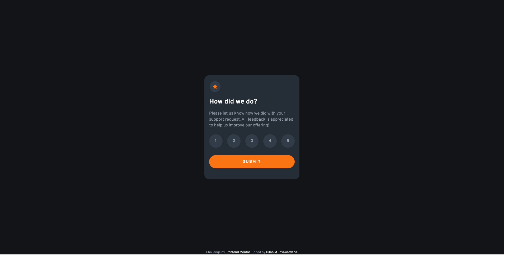
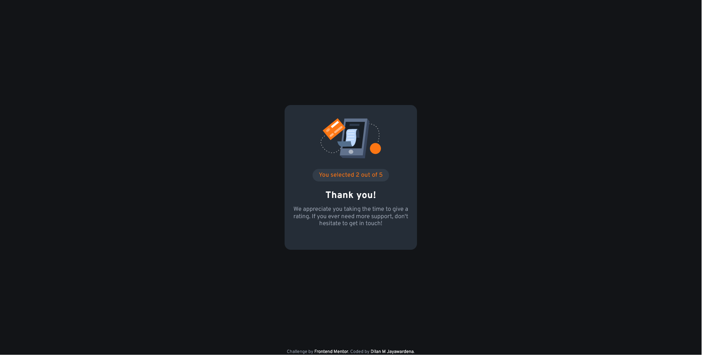
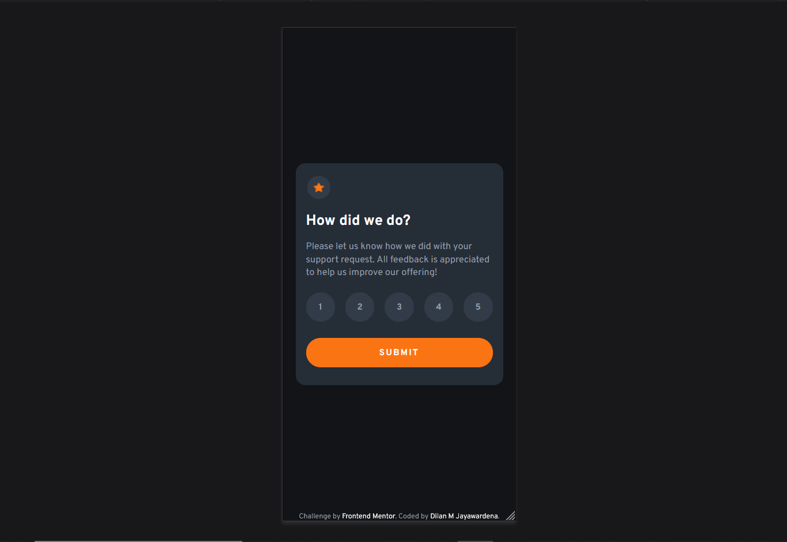
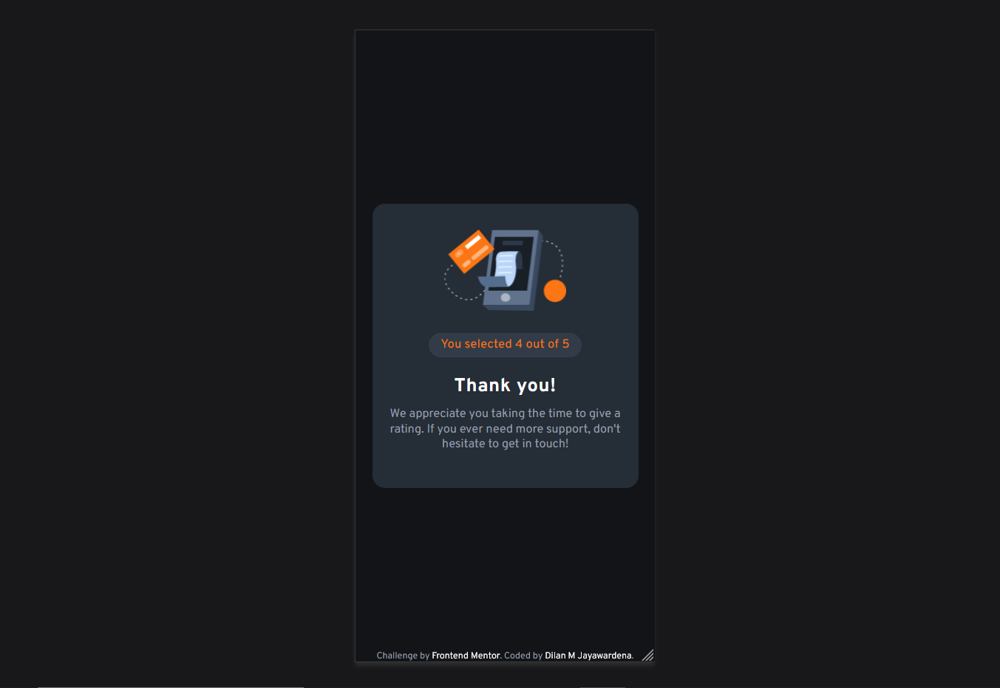

# Frontend Mentor - Interactive rating component solution

This is a solution to the [Interactive rating component challenge on Frontend Mentor](https://www.frontendmentor.io/challenges/interactive-rating-component-koxpeBUmI). Frontend Mentor challenges help you improve your coding skills by building realistic projects. 

## Table of contents

- [Overview](#overview)
  - [The challenge](#the-challenge)
  - [Screenshot](#screenshot)
  - [Links](#links)
- [My process](#my-process)
  - [Built with](#built-with)
  - [What I learned](#what-i-learned)


**Note: Delete this note and update the table of contents based on what sections you keep.**

## Overview

### The challenge

Users should be able to:

- View the optimal layout for the app depending on their device's screen size
- See hover states for all interactive elements on the page
- Select and submit a number rating
- See the "Thank you" card state after submitting a rating

### Screenshot







### Links


- Live Site URL: [Add live site URL here](https://your-live-site-url.com)

## My process

### Built with

- CSS custom properties
- Flexbox
- CSS Grid
- Mobile-first workflow
- Sass

### What I learned

In this project I tried to practice how to work with Sass mixins and Sass map

This is how I used Sass map, Sass mixin:

```css
// 700px, 900px , 1440px

// sass maps - this keeps related values at a same place
$breakpoints-up : (
    // larger screens
    'medium-L' : 375px,
    'large-L' : 900px,
    'exLarge-L' : 1440px,

    // smaller screens
    'medium' : 699px,
    'large' : 899px,
    'exLarge' : 1339px
);

$property-val : (
    'smaller': 'max-width',
    'larger' : 'min-width'
);

// sass mixins, things we use repeatedly wrapped at a one place
@mixin breakpoint($property, $size){
    @media (map-get($property-val, $property): map-get($breakpoints-up, $size)) {
        @content;
    }
}
```

This is how I used javascript to this project :
```js
// getting references
const ul = document.querySelector('.main-cont__outer-rate');
const btn = document.querySelector('.main-cont__outer-btn');
const respond = document.querySelector('.main-cont__respond-outer');
const rateVal = document.getElementById('updateRate');

// listening to the click event on list items
ul.addEventListener('click', e => {
    if(e.target.nodeName === 'LI') {
     e.target.style.backgroundColor = "var(--Orange)";   
     e.target.style.color = "var(--White)";   
    }
    console.log(e);
    switch(e.target.value) {
        case 1:
            rateVal.textContent = e.target.value;
            break
        case 2:
            rateVal.textContent = e.target.value;
            break
        case 3:
            rateVal.textContent = e.target.value;
            break
        case 4:
            rateVal.textContent = e.target.value;
            break
        case 5:
            rateVal.textContent = e.target.value;
            break
        default:
            console.log('invalid entry');    
    }
});

// thank you dialog window trigger part
btn.addEventListener('click', () => {
        respond.style.display = "block";
});
}
```

## Author
- Frontend Mentor - [iamdylanmj](https://www.frontendmentor.io/profile/iamdylanmj)
- Twitter - [DylanM](https://twitter.com/DilanMa98729384)

